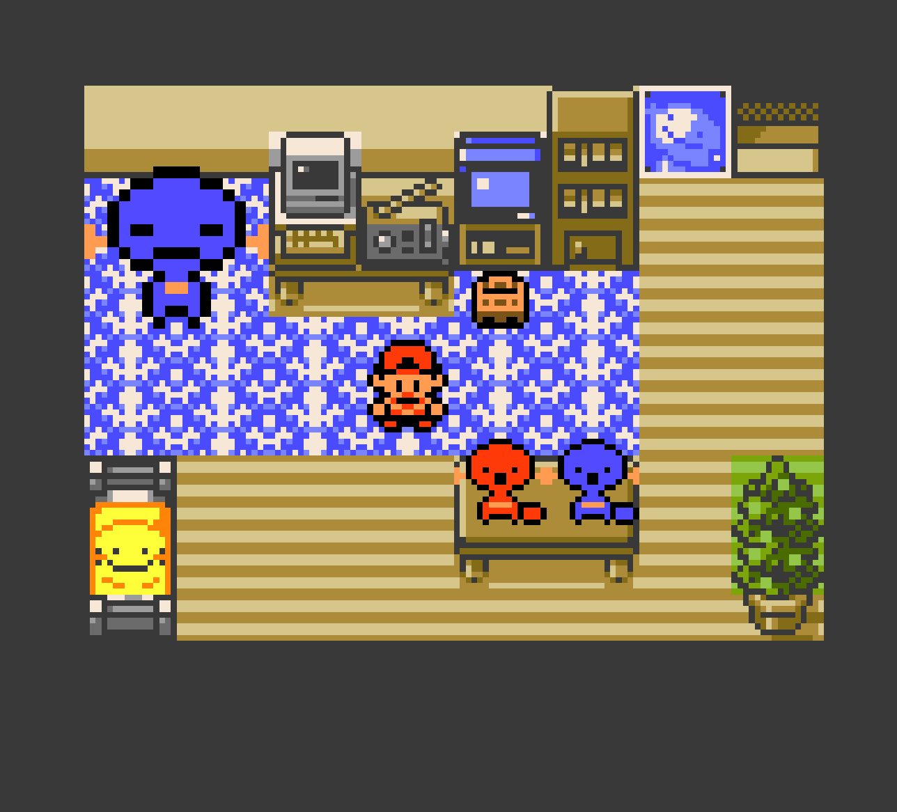

# Wooper: Polished Crystal

A modernized version of Pokémon Crystal, but only Wooper.

Based on [the Pokémon Crystal disassembly](https://github.com/pret/pokecrystal) and Rangi42's [Polished Crystal](https://github.com/Rangi42/polishedcrystal).

## Download and Play

Just download the latest ips patch from the Releases section and patch it on a clean Pokémon Crystal ROM. 

Or build it yourself, see [INSTALL.md](INSTALL.md).

## Features

* No more Pokémon. Only Wooper.
* 254 kinds of Wooper to catch and train!
* Based on Polished Crystal, so modernized mechanics like physical/special split, Fairy, and more.
* For all Polished Crystal mechanics, see [FEATURES.md](FEATURES.md).
* Wooper statues! Wooper decorations! 
* Woopdex! Woop balls! Woop slots! And more!

## Screenshots

  

  

